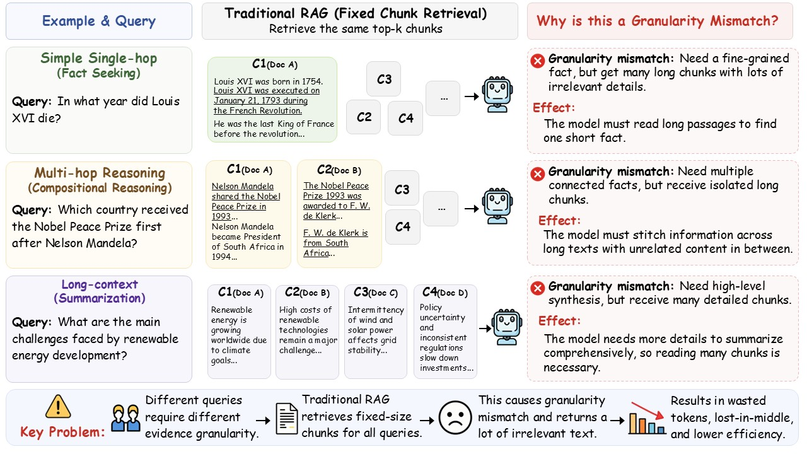
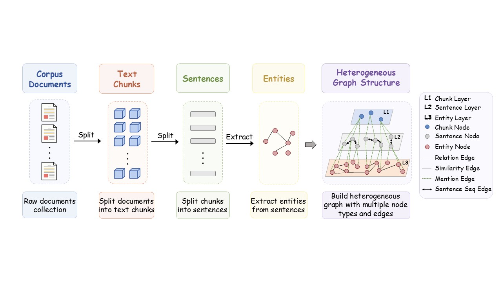
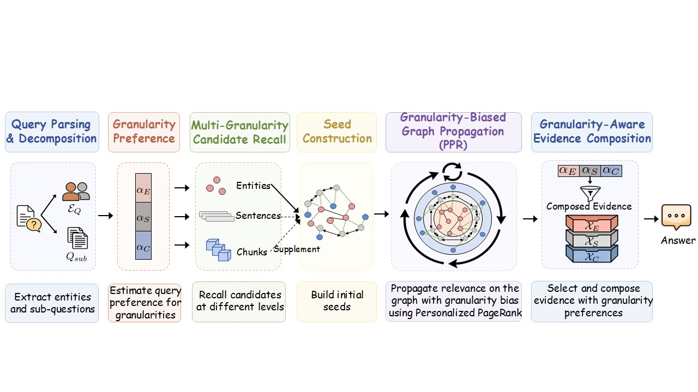

<div align="center">

# 🧩 HoloRAG

### Granularity-Aware Retrieval and Reasoning over Multi-granularity Graphs

**A query-aligned RAG framework that reasons over entities, sentences, and chunks instead of relying on one fixed retrieval granularity.**

[](figures/HoloRAG.pdf)


</div>

## ✨ What Is HoloRAG?

HoloRAG addresses a common limitation in retrieval-augmented generation: different questions need evidence at different semantic scopes, but many RAG systems retrieve from a fixed unit such as passages or chunks.

Instead, HoloRAG builds a heterogeneous graph across multiple evidence granularities and lets each query choose the evidence scale it needs:

- **Entity-level evidence** for precise entity constraints.
- **Sentence-level evidence** for localized multi-hop reasoning.
- **Chunk-level evidence** for broader long-context understanding.
- **Graph propagation** to connect evidence across granularities.

The core retrieval preference is represented as:

```text
alpha = {entity, sentence, chunk}
```

`alpha` can be selected by a task profile or inferred automatically by the intent router.

## 🖼️ Method Overview

### Granularity Mismatch

Fixed-granularity retrieval can return evidence that is relevant but poorly aligned with the question's semantic scope.

<p align="center">
  
</p>

### Multi-granularity Graph Construction

HoloRAG organizes entities, sentences, chunks, and their cross-granularity connections into a unified graph.

<p align="center">
  
</p>

### Question-aware Reasoning

For each query, HoloRAG routes retrieval toward the most suitable granularity and composes compact evidence for answer generation.

<p align="center">
  
</p>

## 🚀 Installation

```bash
git clone <repo-url>
cd HoloRAG
python -m venv .venv
source .venv/bin/activate
pip install -e .
python -m spacy download en_core_web_sm
```

HoloRAG uses an OpenAI-compatible LLM endpoint and a dense embedding model such as `nvidia/NV-Embed-v2`. Both are configurable from the command line.

## 📦 Data Format

`main.py` accepts a JSON corpus file. The file can be either a list of documents or an object containing documents under keys such as `documents`, `docs`, `corpus`, `paragraphs`, `contexts`, or `passages`.

```json
{
  "question": "Your question here",
  "documents": [
    {
      "title": "doc_1",
      "text": "Document text goes here."
    }
  ]
}
```

Each document should contain a non-empty text field such as `text`, `content`, or `body`.

## ⚡ Quick Start

Build an index:

```bash
python main.py index \
  --corpus_file dataset/hotpotqa_canonical.json \
  --output_dir outputs/demo \
  --llm_base_url http://127.0.0.1:8000/v1 \
  --llm_name /path/to/llm \
  --embedding_name nvidia/NV-Embed-v2 \
  --embedding_device cuda:0
```

Run a query:

```bash
python main.py query \
  --corpus_file dataset/hotpotqa_canonical.json \
  --query_text "Your question here" \
  --output_dir outputs/demo \
  --task_profile auto \
  --llm_base_url http://127.0.0.1:8000/v1 \
  --llm_name /path/to/llm \
  --embedding_name nvidia/NV-Embed-v2 \
  --embedding_device cuda:0
```

Task profiles:

- `single_hop`: entity-focused retrieval.
- `multi_hop`: entity and sentence retrieval with query decomposition.
- `long_context`: chunk-focused retrieval.
- `auto`: automatic granularity routing.

The latest query result is saved to:

```text
<output_dir>/last_query_result.json
```

## 🧪 Python API

```python
from holorag import HoloRAG, HoloRAGConfig

config = HoloRAGConfig(
    llm_base_url="http://127.0.0.1:8000/v1",
    llm_model_name="/path/to/llm",
    embedding_model_name="nvidia/NV-Embed-v2",
    embedding_device="cuda:0",
    save_dir="outputs/demo",
)

rag = HoloRAG(config)
rag.index([{"title": "doc_1", "text": "Document text goes here."}])
result = rag.query("Your question here")
print(result["predicted_answer"])
```

## 📁 Repository Structure

```text
HoloRAG/
|-- main.py             # Command-line entry point
|-- src/holorag/        # Core HoloRAG package
|-- dataset/            # Example and canonicalized datasets
|-- scripts/            # Evaluation scripts
|-- figures/            # Paper figures and PDF
|-- results/            # Generated outputs
|-- requirements.txt
`-- setup.py
```

## 📄 Paper

The paper draft is available at [figures/HoloRAG.pdf](figures/HoloRAG.pdf).

## 📝 License

This project is released under the MIT License.
